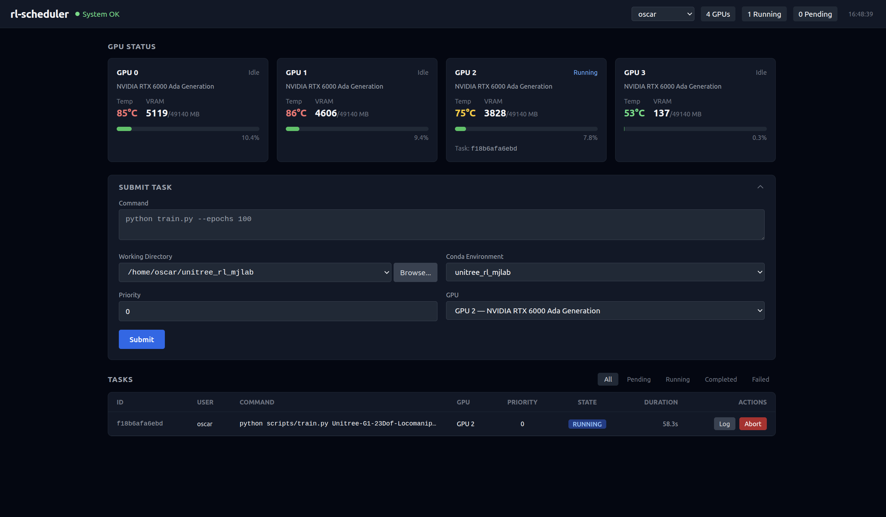

# rl-scheduler

A GPU workload manager that prevents resource contention on multi-GPU machines. It queues ML/RL training jobs and dispatches them to isolated GPUs, ensuring each physical GPU runs exactly one training script at a time.

## Features

- **GPU isolation** via `CUDA_VISIBLE_DEVICES` and `CUDA_DEVICE_ORDER=PCI_BUS_ID` — each job sees only its assigned GPU
- **Priority queue** — higher-priority tasks dispatch first
- **Multi-user aware** — per-user conda environments and working directories
- **Python environment support** — conda and venv, with automatic python binary resolution
- **Manual GPU selection** — pin a task to a specific GPU or let the scheduler auto-assign
- **Persistent queue** — SQLite-backed task state survives server restarts
- **Restart-safe execution** — systemd-managed jobs keep running while the app is closed and are reconciled on restart
- **Live dashboard** — web UI with GPU monitoring, task submission, log viewing, and abort
- **Process group management** — abort kills the entire process tree, not just the parent
- **Live log viewing** — view stdout/stderr while a task is still running
- **Progress tracking** — live progress bars and ETA for rsl_rl-format training logs
- **External process detection** — GPUs show "Busy" when non-scheduler compute processes are running
- **Task management** — delete individual or bulk-delete completed/failed tasks and their logs
- **Task state filters** — filter task table by PENDING/RUNNING/COMPLETED/FAILED
- **GPU fan control** — monitor fan speed/temperature, set manual fan speed or auto mode via the dashboard
- **Admin password** — protect privileged operations (abort/delete in admin mode) with a configurable password

## Screenshots

<p align="center">
  
</p>

## Project Structure

```
rl-scheduler/
├── main.py           # FastAPI app, REST endpoints, static file serving
├── models.py         # Pydantic models, SQLite schema, DB helpers
├── scheduler.py      # Async orchestrator loop, task dispatch, subprocess management
├── hardware.py       # pynvml GPU telemetry and availability checks
├── environments.py   # System-user and Python environment resolution
├── systemd_runner.py # Persistent transient-service execution backend
├── requirements.txt  # Python dependencies
├── requirements-dev.txt # Test dependencies
├── start.sh          # Convenience launcher (sudo python3 main.py)
├── tests/             # pytest API, database, and scheduler tests
├── static/
│   └── index.html    # Single-page dashboard (Tailwind CSS + vanilla JS)
├── doc/
│   └── dashboard.png # Dashboard screenshot
├── logs/             # Auto-created; per-task stdout/stderr logs
└── scheduler.db      # SQLite database (created at runtime)
```

## Requirements

- Python 3.10+
- NVIDIA GPU with drivers installed
- `nvidia-smi` working (through the `nvidia-ml-py` NVML bindings)
- systemd system manager access (the server normally runs as root)
- conda (optional, only needed if using `conda_env`)

## Installation

```bash
pip install -r requirements.txt
```

For development and tests:

```bash
pip install -r requirements-dev.txt
PYTEST_DISABLE_PLUGIN_AUTOLOAD=1 pytest -q
```

## Usage

Start the server:

```bash
sudo -E python3 main.py
# or: ./start.sh
```

The server runs on `http://0.0.0.0:8000`. Opening this URL in a browser loads the dashboard.

### Quick test via curl

```bash
# Submit a task
curl -X POST http://localhost:8000/tasks/submit \
  -H "Content-Type: application/json" \
  -d '{"username": "your-user", "command": "echo hello && sleep 2", "work_dir": "/tmp"}'

# Check task status
curl http://localhost:8000/tasks/status

# View GPU status
curl http://localhost:8000/gpus
```

## REST API

| Method | Path | Description |
|--------|------|-------------|
| `POST` | `/tasks/submit` | Submit a new task |
| `GET`  | `/tasks/status` | List tasks (`state`, `username`, `q`, `limit`, and `offset` are optional) |
| `POST` | `/tasks/{task_id}/abort` | Force-kill a running or pending task (`username` or `X-Admin-Password`) |
| `GET`  | `/tasks/{task_id}/log` | Get a full log or bounded/incremental output with `tail_bytes` or `offset` |
| `DELETE` | `/tasks` | Delete completed/failed tasks (`username` or `X-Admin-Password`) |
| `DELETE` | `/tasks/{task_id}` | Delete one completed/failed task (`username` or `X-Admin-Password`) |
| `GET`  | `/gpus` | Live GPU telemetry (temp, VRAM, active task, external process count, fan status) |
| `PUT` | `/gpus/{gpu_id}/scheduling` | Enable or disable new task assignments (administrator password required each time) |
| `POST` | `/gpus/{gpu_id}/fan` | Set fan mode and speed (`{"mode": "auto"}` or `{"mode": "manual", "speed": 50}`) |
| `GET`  | `/users` | List system users (uid ≥ 1000 with valid home dir) |
| `GET`  | `/conda/envs/{username}` | List conda environments available to a user |
| `GET`  | `/workdirs/{username}` | List top-level directories in user's home |
| `GET`  | `/workdirs/{username}/browse` | Browse subdirectories in user's home (`?path=`) |
| `GET`  | `/envs/scan-venvs` | Scan a directory for Python venvs (`?path=` and `?username=`) |
| `GET`  | `/health` | System health summary |

### Submit a task

```bash
curl -X POST http://localhost:8000/tasks/submit \
  -H "Content-Type: application/json" \
  -d '{
    "username": "your-user",
    "command": "python train.py --epochs 100",
    "work_dir": "/home/your-user/project",
    "conda_env": "my-env",
    "preferred_gpu_id": 0,
    "priority": 10
  }'
```

Fields:
- `username` **(required)** — the system user to run the command as
- `command` **(required)** — the shell command to execute
- `work_dir` (default: `.`) — working directory for the subprocess
- `env_type` (default: null) — `"conda"` or `"venv"`; selects which resolution strategy to use with `conda_env`
- `conda_env` (default: null) — environment name (conda) or full path (venv); `python`/`python3` in the command is replaced with the env's python binary
- `preferred_gpu_id` (default: null) — pin to a specific GPU, or null for auto-assign
- `priority` (default: 0) — higher values dispatch first

### List tasks

```bash
# All tasks
curl http://localhost:8000/tasks/status

# Filter by state
curl "http://localhost:8000/tasks/status?state=RUNNING"

# Filter by user
curl "http://localhost:8000/tasks/status?username=alice"

# Combined
curl "http://localhost:8000/tasks/status?state=RUNNING&username=alice"
```

### Abort a task

```bash
# Abort by task ID (scoped to a user — no password needed)
curl -X POST "http://localhost:8000/tasks/{task_id}/abort?username=your-user"

# Abort as admin (no user selected — requires admin password)
curl -X POST http://localhost:8000/tasks/{task_id}/abort \
  -H "X-Admin-Password: your-admin-password"
```

### View task logs

```bash
curl http://localhost:8000/tasks/{task_id}/log

# Last 128 KiB (response headers include the next byte offset)
curl "http://localhost:8000/tasks/{task_id}/log?tail_bytes=131072"
```

Works while the task is running — output is streamed to the log file in real time.

## Task Lifecycle

```
PENDING ──claim──> STARTING ──unit active──> RUNNING ──exit 0──> COMPLETED
   │                 │                         │
   └─────────────────┴────abort/failure────────┴──────────────> FAILED
```

- **PENDING** — queued, waiting for a free GPU
- **STARTING** — GPU and systemd unit are assigned and the service is activating
- **RUNNING** — systemd service is active on an assigned GPU
- **COMPLETED** — subprocess exited with code 0
- **FAILED** — subprocess exited with a non-zero code, or was aborted

## GPU Isolation

Each task gets `CUDA_DEVICE_ORDER=PCI_BUS_ID` and `CUDA_VISIBLE_DEVICES=<gpu-index>` injected into its environment. The assigned GPU appears as device 0 to the training script.

A GPU is considered "available" when:
1. Scheduling is enabled for that GPU
2. No scheduler-managed task is currently running on it
3. No non-MPS compute processes are running on it (detected via NVML)

Select a GPU card and use **Disable** under Task scheduling in the GPU control panel to reserve that device for non-compute use. Every enable or disable action requires the administrator password, even when another admin session is active. The setting is stored by PCI bus ID and survives application restarts. Disabled GPUs remain visible for telemetry and fan control, but Auto-select skips them and explicit submissions to them are rejected. Disabling a GPU does not stop its current task; it prevents the next assignment.

GPUs with external compute processes display as "Busy" (yellow), GPUs managed by a scheduler task display as "Running" (blue), and GPUs excluded from scheduling display as "Disabled" (red).

## Python Environment Support

Set `env_type` to `"conda"` or `"venv"` and provide the environment identifier in `conda_env`.

**Conda:** The scheduler locates the target environment's python binary at `/home/<user>/<conda_dir>/envs/<env>/bin/python` (checking anaconda3, miniconda3, and miniforge3). It also reads `~/.conda/environments.txt` for additional env paths. The `base` environment is always available. The command runs under `bash -l` so conda-initialized shell environments are picked up.

**Venv:** `conda_env` should be the full path to the venv directory. The scheduler uses `<conda_env>/bin/python` as the python binary. The path must be within the user's home directory.

## GPU Fan Control

GPU fan speeds are displayed on each GPU card in the dashboard. Clicking a GPU card opens its control panel, which contains scheduling controls and, when supported, automatic/manual fan controls.

Fan control requires root privileges (the server runs with `sudo`) and is only supported on consumer GPUs (RTX series). Datacenter GPUs (A100, H100) typically use passive cooling and do not support NVML fan control. Fan support is detected automatically at runtime.

On server shutdown, all fans are reset to automatic mode.

```bash
# Set fan to manual at 70%
curl -X POST http://localhost:8000/gpus/0/fan \
  -H "X-Admin-Password: your-admin-password" \
  -H "Content-Type: application/json" \
  -d '{"mode": "manual", "speed": 70}'

# Reset fan to automatic
curl -X POST http://localhost:8000/gpus/0/fan \
  -H "X-Admin-Password: your-admin-password" \
  -H "Content-Type: application/json" \
  -d '{"mode": "auto"}'
```

## Admin Password

`start.sh` defaults `ADMIN_PASSWORD` to `admin` and the inactivity timeout to five minutes. **Change the default password before running the service on a shared or network-accessible host.** Either edit `start.sh` or override its defaults in the environment:

```bash
export ADMIN_PASSWORD="your-secret"
export ADMIN_SESSION_TIMEOUT_SECONDS=300  # optional; 1-86400
./start.sh
```

When set:
- **User-scoped operations** (selecting a user and managing their own tasks) — no password required
- **Admin mode** (no user selected) — password required for abort, delete, and delete-all
- **Cross-user operations** (managing another user's tasks) — requires admin credentials
- **GPU fan control** — always requires admin credentials

The dashboard exchanges the password at `POST /admin/session` for a random, process-local token. It keeps that token only in browser memory and sends it as `X-Admin-Token`; each successful privileged operation renews the inactivity timeout. Use **Lock** to revoke it immediately. Refreshing the page, restarting the service, or remaining idle past the timeout requires the password again.

Existing API clients may continue sending `X-Admin-Password` or the `admin_password` query parameter. New integrations should create a session and use `X-Admin-Token` so the password is not sent with every operation.

If `ADMIN_PASSWORD` is not set, privileged admin and fan operations return 403 (disabled).

## App Restart Recovery

Each dispatched task runs as `rl-scheduler-task-<task_id>.service`, a transient systemd service with retained exit status. Closing or restarting the web app leaves these units running. On startup, the scheduler restores active GPU registrations, continues log/progress tracking, and records tasks that completed while it was offline. Abort explicitly kills the unit's complete control group.

If systemd cannot be queried, `/health` reports `degraded`, existing task states are preserved, dispatch pauses, and new submissions return HTTP 503. Transient units survive app restarts but not a host reboot.
